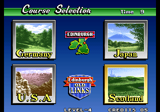
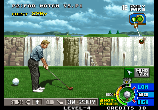

# Neo Turf Masters Scotland

### A transplant of the Scotland course from the Neo Geo CD version of Neo Turf Masters into the MVS (arcade) / AES (home console) version of the game.



Neo Turf Masters is the finest arcade-style golf game ever made.  Released by Nazca in early 1996 for the Neo Geo MVS (arcade) and AES (home console), it features four distinct 18-hole golf courses: Germany, Japan, USA, and Australia.  In May of 1996 Nazca released an expanded version of the game exclusively for the Neo Geo CD console that featured a very challenging, very difficult to unlock fifth course: Scotland.  Unfortunately, the Neo Geo CD was plagued by miserably long load times, and today the console and its games are extremely expensive and difficult to find.

This current work, undoubtably the single most important arcade ROM hack since the General Computer Corporation put Ms. to Pac Man, takes the original MVS/AES ROM set and replaces the old Australia course with the Scotland course from the Neo Geo CD version of the game.  This includes the Scotland-specific gameplay graphics and hole maps, the cinema and scoreboard backgrounds, and the sound clips played on course selection.  Finally, anyone who can play MVS/AES games can play Neo Turf Masters' most challenging course, and without burdensome load times.




## Patching the ROMs
**NOTE:** Arcade emulators can be notoriously pedantic and fickle.  If you're trying to load this on an emulator (rather than on original hardware or an FPGA device), the arcane steps you may have to take could include: putting the ROM files in a folder called ```turfmast```, clicking through a warning that the ROM files have been modified, and/or invoking the emulator via terminal command.  You might need to zip all the ROM files into a single file.  Consult your specific emulator's implementation and documentation for the details relevant to your use case.

You'll need legitimate copies of the original game ROM files to start with.  

If you're using MAME or a device/program that uses MAME style ROMs, you should start with these 9 files (SHA-1 values shown):
```
148eb747f2f4d8e921eb0411c88a636022ceab80  ./200-c1.c1
d6c7afe035411f3eacdf6868d36f91572dd593e0  ./200-c2.c2
7bded797f3b80fd00bcbe451ac0abe6646b19a14  ./200-m1.m1
e7ef87e1de21d2bb17ef17bb08657e92363f0e9a  ./200-p1.p1
ae1a0b5450869d61b2bb23671c744d3dda8769c4  ./200-s1.s1
ddfee09328632e598fd51537b3ae8593219b2111  ./200-v1.v1
2f1c053040e9d50a6d45fd7bea1b96742bae694f  ./200-v2.v2
e229bc0ea82a371d6ee8fd9fe442b0fd141d0a71  ./200-v3.v3
d55e0f542d928a9a851133ff26763c8236cbbd4d  ./200-v4.v4
```

In the MAME folder of this repository you'll find IPS patch files for these 6 files: 
```200-c1.c1```, ```200-c2.c2```, ```200-m1.m1```, ```200-p1.p1```, ```200-v2.v2```, and ```200-v4.v4```.
Apply the IPS patches using your favorite patcher, https://www.marcrobledo.com/RomPatcher.js/ for example.
Applying the patches to the relevant files should result in a hacked ROM set with these SHA-1 values:
```
cc886b2e07f2a6118928ecea446f4fb6690a28ce  ./200-c1.c1
d36926328405447ae8d93b4b4ac84215a1cd145f  ./200-c2.c2
f8f6082366f5214c140c7435d45e62ea4c0502e5  ./200-m1.m1
83e0b26688499a8e06b9df868b9a830bd14051e6  ./200-p1.p1
ae1a0b5450869d61b2bb23671c744d3dda8769c4  ./200-s1.s1
ddfee09328632e598fd51537b3ae8593219b2111  ./200-v1.v1
db7c504c00503ed715e6c19d432f61d26128eebc  ./200-v2.v2
e229bc0ea82a371d6ee8fd9fe442b0fd141d0a71  ./200-v3.v3
438068d321c2ddee871f4bbf5aa07041320a05b6  ./200-v4.v4
```


Alternatively, if you're on an Analogue Pocket or MiSTer or a device/program that uses their style for ROMs, you should have these 6 unpatched files to start with (SHA-1 values shown):
```
4b887a6d9cc1bf936042c38cca380e6a3421ce4f  ./crom0
17ba0791499db908433b80f37c5fbc89b870084b  ./fpga
7bded797f3b80fd00bcbe451ac0abe6646b19a14  ./m1rom
6a26554135134f7fcb95d4668ede985eb0869581  ./prom
ae1a0b5450869d61b2bb23671c744d3dda8769c4  ./srom
83c275971ab05268c90724418a6b150a4effb443  ./vroma0
```

In the AP folder of this repository you'll find IPS patch files for these 4 files: 
```crom0```, ```m1rom```, ```prom```, and ```vroma0```
Apply the IPS patches using your favorite patcher, https://www.marcrobledo.com/RomPatcher.js/ for example.
Applying the patches to the relevant files should result in a hacked ROM set with these SHA-1 values:
```
959656548263d6ce985c818bd9ba64bef7e7cee6  ./crom0
17ba0791499db908433b80f37c5fbc89b870084b  ./fpga
f8f6082366f5214c140c7435d45e62ea4c0502e5  ./m1rom
5a5f1b280dcce147d54184d1c282cc83633206c7  ./prom
ae1a0b5450869d61b2bb23671c744d3dda8769c4  ./srom
e8c76ee6a5bb3d4af06fd6c44845c405f2003d50  ./vroma0
```

## Version History

### 1.08 - Scorecard par graphics
On the scorecard shown after holes 9 & 18, the SCO course was still showing the graphics for the par values of AUS.  Updated.

### 1.07 - Tree collision behavior
The trees were still behaving like AUS trees, despite looking like SCO trees.  Fixed.

### 1.06 - Replace old AUS nickname on High Score screen
Each course gets a label on the High Score screen.  Australia used 'SEASIDE'.  Replaced with 'HIGHLAND' for the Scotland course.

### 1.05 - Opening Cinema glitch tiles 
A couple of misplaced tiles were appearing in the opening cinema.  Restored to stock.

### 1.04 - Hole 12 Tee shot
The graphics across the chasm on the shot screen from the tee of Hole 12 should look much like those on Hole 5.  They were missing the top line of tiles.  Issue was related to the water-beyond-water flag.  Fixed.

### 1.03 - Course Select - SCOTLAND’ -> ‘Scotland’
I had found it amusing to take the ‘SCOTLAND’ label image directly from the CD version and conspicuously drop it on a button far too small to contain it.  But this was leading to some awkward interactions with graphics from the other courses on the Course Select screen.  And also erroneously triggering a flash in the word ‘Time’, above.   So cobbled together an appropriately capitalized ‘Scotland’ graphic from existing letters and letters improvised in a reasonably consistent style, and installed that on the button instead.

### 1.02 - Putt Master name and shirt graphics
The shirt and name of the Putt Master character had become glitched on the 2 player pre-game screen.  Restored image behavior to that of the unmodified game.

### 1.01 - Audio glitches
The ‘Scotland’ audio cue wasn’t playing on the Course Select screen, and the Contests were erroneously triggering the ‘Edinburgh Old Links’ audio cue.  Sorted.

### 1.00 - Initial release
