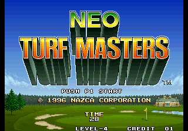

# Neo Turf Masters Scotland

### A transplant of the Scotland course from the Neo Geo CD version of Neo Turf Masters into the MVS (arcade) / AES (home console) version of the game.



Neo Turf Masters is the finest arcade-style golf game ever made.  Released by Nazca in early 1996 for the Neo Geo MVS (arcade) and AES (home console), it features four distinct 18-hole golf courses: Germany, Japan, USA, and Australia.  In May of 1996 Nazca released an expanded version of the game exclusively for the Neo Geo CD console that featured a very challenging, very difficult to unlock fifth course: Scotland.  Unfortunately, the Neo Geo CD was plagued by miserably long load times, and today the console and its games are extremely expensive and difficult to find.

This current work, undoubtably the single most important arcade ROM hack since the General Computer Corporation put Ms. to Pac Man, takes the original MVS/AES ROM set and replaces the old Australia course with the Scotland course from the Neo Geo CD version of the game.  This includes the Scotland-specific gameplay graphics and hole maps, the cinema and scoreboard backgrounds, and the sound clips played on course selection.  Finally, anyone who can play MVS/AES games can play Neo Turf Masters' most challenging course, and without burdensome load times.


## Patching the ROMs
**NOTE:** Arcade emulators can be notoriously pedantic and fickle.  If you're trying to load this on an emulator (rather than on original hardware or an FPGA device), the arcane steps you may have to take could include: putting the ROM files in a folder called ```turfmast```, clicking through a warning that the ROM files have been modified, and/or invoking the emulator via terminal command.  You might need to zip all the ROM files into a single file.  Consult your specific emulator's implementation and documentation for the details relevant to your use case.

You'll need legitimate copies of the original game ROM files to start with.  

If you're using MAME or a device/program that uses MAME style ROMs, you should start with these 9 files (SHA-1 values shown):
```
148eb747f2f4d8e921eb0411c88a636022ceab80  ./200-c1.c1
d6c7afe035411f3eacdf6868d36f91572dd593e0  ./200-c2.c2
7bded797f3b80fd00bcbe451ac0abe6646b19a14  ./200-m1.m1
e7ef87e1de21d2bb17ef17bb08657e92363f0e9a  ./200-p1.p1
ae1a0b5450869d61b2bb23671c744d3dda8769c4  ./200-s1.s1
ddfee09328632e598fd51537b3ae8593219b2111  ./200-v1.v1
2f1c053040e9d50a6d45fd7bea1b96742bae694f  ./200-v2.v2
e229bc0ea82a371d6ee8fd9fe442b0fd141d0a71  ./200-v3.v3
d55e0f542d928a9a851133ff26763c8236cbbd4d  ./200-v4.v4
```

In the MAME folder of this repository you'll find IPS patch files for these 5 files: 
```200-c1.c1```, ```200-c2.c2```, ```200-m1.m1```, ```200-p1.p1```, and ```200-v2.v2```.
Apply the IPS patches using your favorite patcher, https://www.marcrobledo.com/RomPatcher.js/ for example.
Applying the patches to the relevant files should result in a hacked ROM set with these SHA-1 values:
```
5311e7fb9f991db08451a645a9ba4ad5530efc5f  ./200-c1.c1
a43de326c1059ea101b23e933a02edcf77eb66ac  ./200-c2.c2
b7b9dff4575e5b17d6965aa52f4d32984937ad53  ./200-m1.m1
0f7002cc8e9c2f170429e7d2d00a9dbfd20f2e16  ./200-p1.p1
ae1a0b5450869d61b2bb23671c744d3dda8769c4  ./200-s1.s1
ddfee09328632e598fd51537b3ae8593219b2111  ./200-v1.v1
f0a3e83c300a6b09ac2cd61b6e639c06d1e9bf88  ./200-v2.v2
e229bc0ea82a371d6ee8fd9fe442b0fd141d0a71  ./200-v3.v3
d55e0f542d928a9a851133ff26763c8236cbbd4d  ./200-v4.v4
```


Alternatively, if you're on an Analogue Pocket or MiSTer or a device/program that uses their style for ROMs, you should have these 6 unpatched files to start with (SHA-1 values shown):
```
4b887a6d9cc1bf936042c38cca380e6a3421ce4f  ./crom0
17ba0791499db908433b80f37c5fbc89b870084b  ./fpga
7bded797f3b80fd00bcbe451ac0abe6646b19a14  ./m1rom
6a26554135134f7fcb95d4668ede985eb0869581  ./prom
ae1a0b5450869d61b2bb23671c744d3dda8769c4  ./srom
83c275971ab05268c90724418a6b150a4effb443  ./vroma0
```

In the AP folder of this repository you'll find IPS patch files for these 4 files: 
```crom0```, ```m1rom```, ```prom```, and ```vroma0```
Apply the IPS patches using your favorite patcher, https://www.marcrobledo.com/RomPatcher.js/ for example.
Applying the patches to the relevant files should result in a hacked ROM set with these SHA-1 values:
```
dbb92a13e2f008f67b4f6cb1ca2b584d3b2969da  ./crom0
17ba0791499db908433b80f37c5fbc89b870084b  ./fpga
b7b9dff4575e5b17d6965aa52f4d32984937ad53  ./m1rom
b4d37af9b54fa88983a76569af979c68e6dc58b5  ./prom
ae1a0b5450869d61b2bb23671c744d3dda8769c4  ./srom
0a2039df7c1ed212ab353dd572f889bb8f317470  ./vroma0
```
